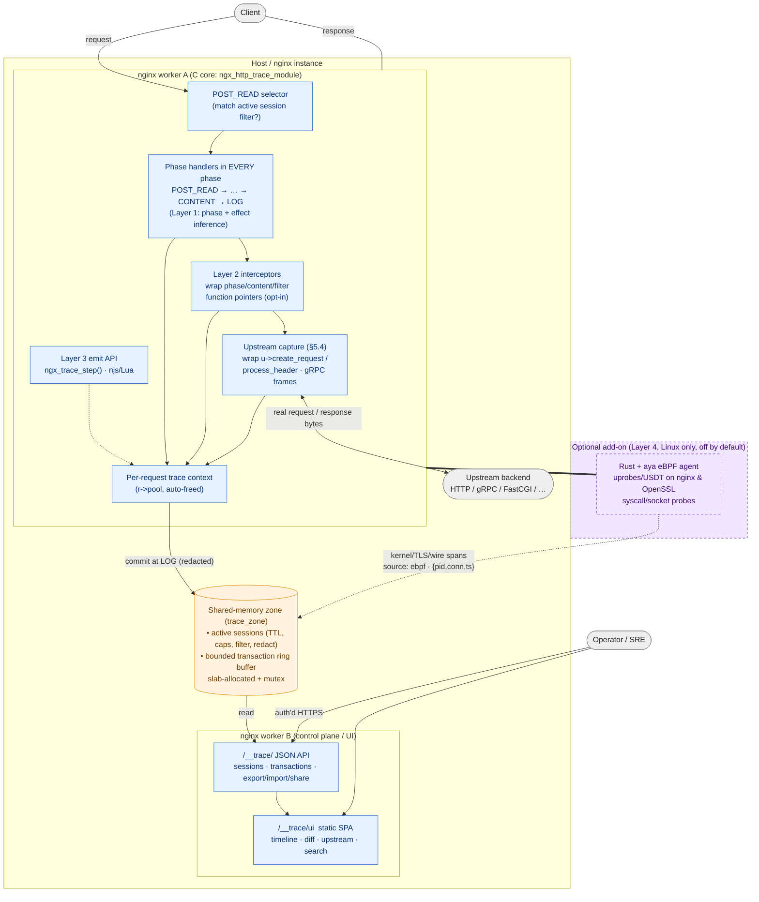
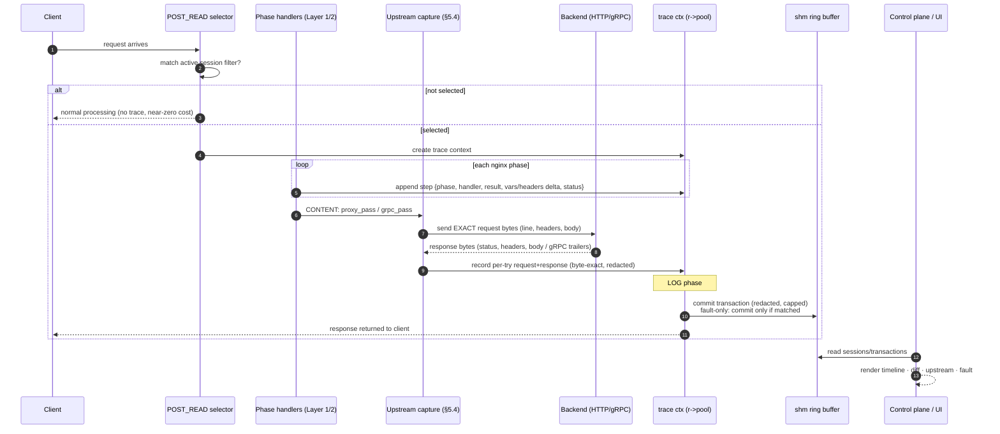

# ngx-trace — An Apigee-style Request Debugger for nginx

> **Status:** Idea / Concept document (no implementation yet)
> **Author:** (draft)
> **Last updated:** 2026-07-25 (added §5.4.1 client request/response **body
> capture** — distinct from upstream bodies, opt-in, capped, redaction-aware;
> new goal #4, `request_body`/`response_body` in the Transaction model (§6),
> cross-check rows updated (§15); earlier — added §3.4 session lifecycle — time-boxed
> capture window → list of captured requests → detail-on-demand; added
> `TransactionSummary` list-tier schema (§6), session `state`/`stopped_reason`,
> and two-tier list/detail API framing (§8); earlier — added §5.0.1 detailed
> solution architecture + §5.0.2 request→transaction data-flow Mermaid diagrams;
> consistency pass: fixed section numbering
> §15/§16, reconciled Layer-4 references — "four stacking layers", Phase-4
> framing, and Rust/`aya` agent tech; earlier — **decided the implementation split —
> C core module + Rust/`aya` eBPF add-on** (§5.6); added §5.5 eBPF-only
> feasibility & architecture options; prior revision — Apigee single-call
> cross-check adding step status, conditional steps, variable read/set semantics,
> fault capture & filtering, Properties, Epsilon timing, search, view options,
> share URL, offline viewer, retention; see §15)

---

## 1. Summary

`ngx-trace` is a proposed nginx module (plus a companion UI/API) that lets an
operator **attach a live debug session to a running nginx instance and watch a
single request flow through every processing stage** — exactly the way
Apigee's **Debug / Trace** tool visualizes an API proxy transaction.

For a selected request you would see, step by step:

- Which nginx **phase** the request is in (post-read, rewrite, access, content, log, …).
- The **request headers** as they arrive and how they mutate at each step.
- The **nginx variables** (`$uri`, `$args`, `$upstream_addr`, custom `$var`s…) and how their values change.
- Which **modules / handlers ("plugins")** ran, in what order, what each returned, and how long each took.
- The **upstream/proxy** decision: chosen upstream, resolved address, the exact
  URL, method, headers and body sent to the backend, and the response received —
  including **first-class gRPC** (`grpc_pass`): HTTP/2 metadata, per-message
  framing, and the real `grpc-status`/`grpc-message` from trailers.
- **Timings** for each stage and the total transaction (with a sub-millisecond
  "ε" marker like Apigee's *Epsilon*).
- The **client request body** the caller sent and the **client response body**
  returned (Apigee *Request/Response Content* parity) — distinct from the
  upstream bodies, optional and size-capped.
- The **final response** headers/status returned to the client.
- The **status of each step** (success / error / skipped / disabled) and any
  **conditional-flow** (`if`/`map`/`try_files`) decisions, so you see what was
  *evaluated and skipped*, not only what ran.
- On failure, the **fault**: which handler/phase denied or errored the request,
  the finalizing status, and an `error.state` analog — with the option to capture
  **only failing requests** (Apigee `fault.code`-style filtering).

The goal is to give nginx the "glass box" debugging experience that gateways
like Apigee, Kong (with its debug/trace plugins) and Envoy (with tap) provide,
but native to nginx's phase/handler architecture.

**Workflow (like Apigee).** You start a **time-boxed capture session** (e.g.
5–10 minutes / N requests); as traffic flows, a **list of captured requests**
builds up (start→end, method, path, status, duration, fault badge); and when you
**select a request, its full step-by-step detail is returned on demand**. Capture
is bounded and list-first, so overhead stays low and triage is fast (see §3.4).

---

## 2. Motivation

nginx is extremely powerful but its request lifecycle is essentially a **black
box** at runtime. When a request behaves unexpectedly you typically resort to:

- Turning on `debug` error logging (very verbose, per-worker, hard to correlate a single request, requires a debug build).
- Adding `add_header` / `log_format` entries and re-reading logs.
- `tcpdump`/`mitmproxy` on the upstream connection.
- Trial-and-error with `rewrite ... break`, `map`, and `if`.

None of these give a **single, per-request, ordered, visual timeline** of what
happened inside nginx: which phase mutated which variable, which handler denied
access, why a particular `location`/upstream was chosen, and what was ultimately
sent upstream.

Apigee solves this for its own runtime with the Debug tool: you start a debug
session on a deployed proxy, send traffic, and each transaction is captured as a
sequence of steps (flow segments, policy executions, variable snapshots,
request/response at each boundary). **`ngx-trace` brings that model to nginx.**

### Who benefits

- **Platform / SRE teams** debugging production routing, auth, and upstream issues without redeploying.
- **API gateway operators** using nginx as an edge/API gateway (with auth, rate-limit, rewrite, `njs`/Lua plugins).
- **Module developers** who need to see how their handler interacts with the rest of the phase pipeline.
- **Support engineers** reproducing customer issues with a shareable trace artifact.

---

## 3. Background: how the two worlds map

### 3.1 Apigee's debug model (reference)

Apigee's Debug tool records, per transaction, an ordered list of **steps**. Key
concepts we borrow:

- A **debug session** is started explicitly, has a **time limit** and a
  **max number of transactions** (e.g. 10–20), and optionally a **filter**
  so only matching requests are captured.
- Each transaction is a **timeline of phases/segments** (request flow → target
  request → target response → response flow), and within each, the individual
  **policies** that executed.
- Every step carries a **variable/property snapshot** and the **message state**
  (headers, query params, body) at that point, so you can see what changed.
- The output is viewable in a **UI (visual timeline)** and downloadable as a
  **structured document** (Apigee uses a JSON/"debug session" format) for
  offline analysis.

### 3.2 nginx's request lifecycle (what we can actually observe)

nginx processes each HTTP request through a fixed, ordered sequence of **phases**
(from nginx's development guide). These are the natural analog of Apigee's flow
segments:

| # | nginx phase (`NGX_HTTP_*`) | What happens | Typical modules ("plugins") |
|---|----------------------------|--------------|-----------------------------|
| 1 | `POST_READ` | First phase after headers read | `realip` (client addr substitution) |
| 2 | `SERVER_REWRITE` | `rewrite` directives in `server{}` scope | `rewrite` |
| 3 | `FIND_CONFIG` | **Location selected from URI** (no custom handlers) | core |
| 4 | `REWRITE` | `rewrite` directives in the chosen `location{}` | `rewrite` |
| 5 | `POST_REWRITE` | Re-loops to `FIND_CONFIG` if URI changed (no custom handlers) | core |
| 6 | `PREACCESS` | Pre-authorization common handlers | `limit_conn`, `limit_req` |
| 7 | `ACCESS` | Authorization checks | `access`, `auth_basic`, `auth_request` |
| 8 | `POST_ACCESS` | `satisfy any` resolution (no custom handlers) | core |
| 9 | `PRECONTENT` | Called before content generation | `try_files`, `mirror` |
| 10 | `CONTENT` | Response is generated | `static`, `index`, `proxy_pass`, `fastcgi`, `njs`, Lua |
| 11 | `LOG` | Runs at the very end, right before request is freed | `log` |

Additional observable surfaces beyond phases:

- **Variables**: nginx variables are lazily evaluated; we can snapshot the ones
  that have been evaluated and force-evaluate a configured watch-list.
- **Header filters / body filters**: the output header filter chain and body
  filter chain (response mutation) — analogous to Apigee's response flow.
- **Upstream / proxy**: when a request is proxied, we can capture the chosen
  `upstream`, the resolved peer address, request line/headers/body sent, and the
  status/headers/timing of the upstream response (`$upstream_*` variables).
- **Subrequests**: nginx subrequests (e.g. `auth_request`, SSI, `mirror`) form a
  tree — analogous to Apigee's chained/shared flows.

Phase handlers return codes we can record as the "result" of each step:
`NGX_OK` (next phase), `NGX_DECLINED` (next handler), `NGX_AGAIN`/`NGX_DONE`
(suspend), or an HTTP status (finalize). Capturing these return codes is what
lets us show *why* a request stopped or was denied.

**Step status (Apigee parity).** Apigee marks each step with a *status* —
`success`, `error`, `skipped` (its condition was false), or `disabled` — and
distinguishes **conditional-flow** steps that evaluated `true` vs `false`.
nginx has analogous observable signals we map onto the same status vocabulary:

| Apigee step status | nginx analog `ngx-trace` records |
|--------------------|-----------------------------------|
| `success` | Handler ran and returned `NGX_OK`/`NGX_DECLINED` normally |
| `error` | Handler finalized with a 4xx/5xx, or a `try_files`/access/proxy error; `denied_by`/fault populated |
| `skipped` | A handler present in a phase but short-circuited (e.g. `if`/`map` branch not taken, `satisfy` already met, `limit_*` under threshold) — inferred from effect/return |
| `disabled` | A directive/module compiled-in but inactive for this location (config-derived) |
| conditional `true`/`false` | `if (...)`, `map`, `try_files` fallbacks, and internal-redirect decisions — recorded as condition steps with the evaluated boolean and the expression text where available |

This lets the timeline show *not just* what ran, but what was **evaluated,
skipped, or errored** — the difference between an empty timeline and a diagnostic one.

### 3.3 The core mapping

| Apigee concept | nginx equivalent that `ngx-trace` captures |
|----------------|--------------------------------------------|
| Debug session (time-boxed, N transactions, filter) | Trace session stored in shared memory, TTL + max-count + match filter |
| Transaction timeline | Ordered list of phase/handler steps for one `ngx_http_request_t` |
| Flow segment (request/target/response) | Phase groups: client-request phases → upstream request → upstream response → response filters |
| Policy execution step | Individual phase handler / filter / content handler invocation |
| Variable snapshot | Snapshot of watched nginx variables (+ headers) per step |
| Variable read vs. set (`=` / `≠` / empty) | Whether a var was *read*, *assigned* (`set`/`map`/module), or *couldn't be assigned* (read-only/error) at that step |
| Target request/response | `proxy_pass`/`fastcgi_pass` upstream request & response capture |
| Conditional flow (`true`/`false`) | `if`/`map`/`try_files`/internal-redirect decisions recorded as condition steps |
| Fault / RaiseFault + `error.state` | nginx error finalization: which handler/status denied or errored, plus the phase it happened in |
| Properties (internal proxy state) | nginx internal state: chosen `location`, `internal` flag, redirect count, keepalive, `satisfy` mode, request-body state |
| Analytics-captured-data step | The `LOG`-phase step (access-log/analytics equivalent), incl. final status & bytes |
| Shared flow / chained proxy | Subrequest subtree |
| Debug UI + downloadable session | Web UI + JSON export endpoint |

### 3.4 Session lifecycle: capture window → request list → detail on demand

`ngx-trace` follows Apigee's **time-boxed, list-first, detail-on-demand** model.
A debugging session is not "always on" and does not dump every request's full
timeline up front. Instead it runs as a bounded workflow:

1. **Start a capture window (e.g. 5–10 minutes).** The operator starts a session
   with a duration (TTL) and a max-transaction count. From that moment, matching
   requests are captured until either the time runs out or the count is reached —
   then the session **stops capturing automatically** (it can also be stopped
   early). This bounds overhead and memory, and mirrors "start a debug session,
   send some traffic, look at what came in."

2. **Build a list of captured requests (summaries), start → end.** As requests
   are captured they appear in a **lightweight list** — one row per request with
   just enough to triage: timestamp (start/end), method, path, final status,
   total duration, upstream, and a **fault badge** if it failed. This list is
   cheap to produce and to transmit; it does **not** include the heavy per-step
   timeline, headers, variables, or upstream bodies.

3. **Return full detail only when a specific request is asked for.** When the
   operator selects a row, the UI/API fetches that **one transaction's full
   timeline** — every phase/handler step, variable and header deltas, the exact
   upstream request/response bytes (and gRPC framing), Properties, and the fault.
   Detail is fetched **per request, on demand**, so inspecting one request never
   requires materializing all of them.

**Why this shape (not one big dump):**

- **Bounded cost.** The session window + count cap keep capture finite; the
  list/detail split means we never *serialize or ship* full detail for requests
  nobody opens. This directly serves the low-overhead and bounded-memory goals
  (§6, §9).
- **Triage-first UX.** Operators scan the list, spot the slow/failing request via
  the fault badge and duration, then drill in — the natural debugging flow.
- **Clean API mapping.** It is exactly the two-tier API already in §8:
  `GET …/transactions` returns the **summary list**;
  `GET …/transactions/{txn}` returns the **full detail** for one request.

**Implementation note (honest constraint).** nginx frees the request pool right
after the `LOG` phase, so the *full detail must be captured during the request*
and stored (redacted, size-capped) in the shared ring buffer at `LOG`. What is
lazy is **transmission/rendering**, not capture: the list is a cheap projection
of stored transactions, and detail for a given `txn` is returned only when
requested. (Fault-only sessions still apply the commit-only-if-matched rule from
§9, so non-matching requests are discarded rather than stored.)

---

## 4. Goals and non-goals

### 4.1 Goals

1. **Per-request timeline**: an ordered, timestamped list of phases and the
   handlers that ran within each, with each handler's return code and duration.
2. **State diffing with read/set semantics**: for a configurable watch-list of
   variables and headers, show the value at each step and highlight what changed,
   distinguishing (Apigee-style) whether a variable was **read**, **assigned a
   value** (`=`), or **could not be assigned** (`≠`, e.g. read-only or an error
   during evaluation).
3. **Upstream visibility (Apigee target request/response parity)**: capture the
   *actual* request sent to the upstream (method, resolved URL, headers, body)
   and the *actual* response received (status, headers, body), per connection
   try, via deep upstream hooks — not just the coarse `$upstream_*` summary.
   Headers captured byte-exact; bodies optional and size-capped. See §5.4.
4. **Client message bodies (Apigee Request/Response Content parity)**: optionally
   capture the **request body the client sent** and the **response body returned
   to the client** — distinct from the upstream bodies (they can differ after
   rewrite, cache, sub-filter, or gzip). Off by default, size-capped,
   redaction-aware. See §5.4.1.
5. **Non-intrusive activation**: enable tracing on live traffic without a config
   reload, scoped to matching requests only, with strict resource limits.
6. **Two consumption surfaces**: a JSON **API** and a lightweight **web UI**
   timeline viewer; traces are exportable as a shareable artifact.
7. **Low overhead when off**: effectively zero cost for non-traced requests.
8. **Safe by default**: sensitive headers/body redaction, authN/authZ on the
   control/UI endpoints, and hard caps on memory.
9. **Fault/error visibility**: for any request that is denied or errors, show
   **which handler/phase caused it**, the finalizing status, and an `error.state`
   analog — and allow **filtering a session by fault** (capture only failing
   requests), matching Apigee's `fault.code` filters.
10. **Investigation-grade UI parity with Apigee**: a per-transaction **search**,
   **view options** (show/hide skipped, disabled, conditions, flow-info; persisted
   per user), **expand/collapse** of flow groups, a **shareable session URL**, and
   time-boxed **retention** with an **offline viewer** for downloaded sessions.

### 4.2 Non-goals (initial phase)

- Not a profiler/APM replacement (no flame graphs across workers; per-request focus).
- Not a packet capture tool (operates at nginx's HTTP abstraction, not L4).
- Not a config editor (read-only observation; no live policy editing like Apigee's UI edit).
- No modification of request/response from the UI (observe only, at least in v1).
- Not intended to trace TLS handshake internals or the `stream` (L4) module in v1
  (HTTP module first; `stream` support is a later extension).

---

## 5. High-level architecture

```
                    ┌─────────────────────────────────────────────┐
                    │                nginx worker(s)               │
   client ────────► │  ┌────────────────────────────────────────┐ │
   request          │  │ ngx_http_trace_module                  │ │
                    │  │  • handlers registered in EVERY phase  │ │
                    │  │  • wraps/observes filters & upstream   │ │
                    │  │  • per-request trace context (in pool) │ │
                    │  └───────────────┬────────────────────────┘ │
                    │                  │ append step               │
                    │        ┌─────────▼─────────┐                 │
                    │        │ trace ring buffer │  (shared memory │
                    │        │  (slab-allocated) │   zone, all     │
                    │        └─────────▲─────────┘   workers)      │
                    └──────────────────┼──────────────────────────┘
                                       │ read
        control plane / UI worker      │
        ┌──────────────────────────────▼───────────────────────────┐
        │  /trace/api  (JSON)      +      /trace/ui  (static SPA)    │
        │   - start/stop session          - timeline visualization  │
        │   - list sessions               - variable diff view      │
        │   - fetch transaction(s)        - upstream request/resp   │
        │   - export session JSON                                   │
        └───────────────────────────────────────────────────────────┘
```

#### 5.0.1 Solution architecture (detailed)

The diagram below shows the full solution: the **C core** (in-process, always
present) and the **optional Rust/`aya` eBPF add-on** (Layer 4, out-of-process),
both feeding one language-neutral trace stream that the control plane / UI reads.



**How to read it:**

- **Blue** = the C core (`ngx_http_trace_module`) running inside every nginx
  worker. The `POST_READ` selector decides if a request is traced; if not, all
  later handlers early-return so overhead stays near zero (§9).
- The core records into a **per-request trace context** in `r->pool` (auto-freed),
  then **commits the finished, redacted transaction into the shared-memory ring
  buffer** (**orange**) at the `LOG` phase.
- Any worker (here **worker B**) serves the **control plane API + UI** by reading
  that same shared zone — solving cross-worker capture (challenge #2).
- The **upstream capture** hooks (§5.4) sit on the real connection to the backend,
  recording the exact bytes sent/received (incl. gRPC).
- **Purple/dashed** = the optional **Rust/`aya` eBPF add-on** (§5.5/§5.6). It
  attaches from the kernel side, emits the *same* schema tagged `source:"ebpf"`
  correlated by `{worker_pid, connection_id, timestamp}`, and has **no build/run
  dependency** on the core — the core works fully without it.

#### 5.0.2 Traced request → transaction (data flow)



This sequence shows the lifecycle end to end: **selection → per-phase step
capture → exact upstream exchange → commit-at-LOG → read by the UI** — the
concrete realization of the Apigee-style single-call debug timeline.

### 5.1 Components

1. **`ngx_http_trace_module`** — the core C module. It:
   - Registers a handler in **every** phase (including a `POST_READ` handler that
     decides whether this request is "selected" for tracing).
   - Installs **header and body output filters** to observe response mutation.
   - **Captures the exact upstream exchange** — the real request bytes sent to
     the backend (method, resolved URL, headers, body) and the real response
     received (status, headers, body) — by hooking the upstream request/response
     path (`u->create_request`, `u->reinit_request`, `u->process_header`, and the
     upstream input filter / buffers). The coarse `$upstream_*` variables are read
     *in addition*, as an enrichment/fallback, never as the sole source. See §5.4.
   - Maintains a **per-request trace context** allocated in the request pool
     (`r->pool`) so it is freed automatically with the request.
   - Serializes completed transactions into a **shared-memory ring buffer** so
     the control plane (possibly another worker) can read them.

2. **Session store (shared memory zone)** — holds:
   - Active **debug sessions** (id, filter expression, TTL/expiry, max
     transactions, captured count, redaction rules).
   - A bounded **ring buffer** of completed transactions (oldest evicted).
   Slab allocator + mutex, per nginx's shared-memory API.

3. **Control/UI endpoints** — implemented as content-phase handlers on a
   dedicated, access-controlled `location`:
   - `/*` JSON API to manage sessions and fetch traces.
   - Static single-page **UI** that renders the timeline.

4. **(Optional) External collector** — for multi-instance deployments, a small
   sidecar/agent can pull JSON traces and aggregate them centrally (later phase).

### 5.2 Why register in every phase

Registering one handler per phase is the idiomatic nginx way to observe the
pipeline. Each handler:

- Records `{phase, timestamp, request_id}` and a snapshot of the watch-listed
  variables/headers **as they are at the start of that phase**.
- Returns `NGX_DECLINED` so it never alters the request's control flow (it just
  "passes through", letting the next handler in the phase run).

`FIND_CONFIG`, `POST_REWRITE`, and `POST_ACCESS` do **not** accept custom
handlers, so for those we infer transitions by observing the surrounding phases
(e.g., a change in the selected `location` / `$uri` between `SERVER_REWRITE` and
`REWRITE` tells us `FIND_CONFIG` ran and what it chose).

### 5.3 Capturing per-module ("plugin") steps

A "plugin" here means **any nginx module** — whether it is a built-in C module,
a third-party C module compiled statically, or a dynamically loaded C module
(`load_module`). `njs`/Lua scripts are *also* traceable, but they are one
special case among many, **not** the primary mechanism. The design must attribute
steps to arbitrary C modules without requiring those modules to be modified.

We use a layered approach, from most portable to most precise. Layers stack: a
deployment gets as much granularity as its situation allows. Layers 1–3 run
inside nginx; Layer 4 adds an optional out-of-process (eBPF/kernel) plane for
wire- and TLS-level fidelity with zero module cooperation.

#### Layer 1 — Phase-level + effect inference (portable, works for every module)

Record phase-level steps plus the *effects* we can observe (variable/header/URI/
location deltas, the return code that finalized the request, `$upstream_*`). This
requires **zero cooperation** from other modules and works for any C or dynamic
module. It reconstructs most of the "which module did what" story for the common
modules (rewrite, auth, limit, proxy) by attributing observed side effects to the
phase they occurred in.

#### Layer 2 — Generic C-handler interception (works for any C/dynamic module)

Because C modules register their handlers as **function pointers** in nginx's
per-phase handler arrays (`cmcf->phases[phase].handlers`) and in the content
handler slot, `ngx-trace` can, at configuration time (`postconfiguration`, after
all other modules have registered), **walk those arrays and wrap each handler
pointer with a tiny trampoline**. The trampoline:

1. records a step-start (timestamp, phase, and the handler it is about to call);
2. calls the original handler;
3. records the return code and duration.

This yields true **per-handler granularity for any C module** — static or
dynamic — *without modifying that module's source*, since we only rewrap the
pointers nginx already holds. To turn a bare function pointer into a human name,
we resolve it against:

- a **built-in table** of well-known nginx/third-party handler symbols;
- the **module list** (`cf->cycle->modules`) to attribute a handler to its owning
  `ngx_module_t` and thus its module name;
- optionally `dladdr()` on the function pointer to recover a symbol name for
  dynamically loaded modules.

Content handlers (`clcf->handler`, e.g. `proxy_pass`, `fastcgi_pass`, custom
modules) and the **output header/body filter chains** (`ngx_http_top_header_filter`,
`ngx_http_top_body_filter`) are singly linked lists of function pointers we can
similarly wrap to time and name each stage. This is the same well-understood
technique used by existing observability modules; it is intrusive to the *pointer
tables* but not to the *modules themselves*, so it remains generic.

*Trade-offs / guards:* pointer-table layouts are stable but internal, so this
layer is version-aware and can be disabled with a directive; wrapped handlers must
faithfully preserve return-code and `NGX_AGAIN`/`NGX_DONE` (suspend/resume)
semantics so tracing never changes behavior.

#### Layer 3 — Explicit emit-step API (opt-in, for cooperating modules & scripts)

For the richest, unambiguous, self-described steps, expose a small public API,
conceptually `ngx_trace_step(r, name, result, detail)`, that a module author can
call directly. This is **optional** and useful for:

- new C modules that want to describe sub-steps of their own logic;
- the `njs`/Lua scripting layers, where we add a `trace.step(name, ...)` binding
  so each script "plugin" reports itself as a named, timed step (an option to
  check/trace `njs`/Lua modules specifically, on top of the generic C coverage).

Layer 3 mirrors Apigee's per-policy granularity for code that opts in, while
Layers 1–2 still cover everything else generically.

#### Layer 4 — Out-of-process / kernel-assisted tracing (eBPF, uprobes, USDT)

Layers 1–3 all run *inside* nginx. Layer 4 adds an **out-of-process observation
plane** that attaches to the running nginx binary from the kernel side using
**eBPF** (via `uprobes`/`uretprobes` on nginx functions, `USDT` static
tracepoints, and syscall/`tc`/socket hooks). It requires **no module cooperation
and no nginx recompilation** — it attaches to whatever nginx is already running,
including fully third-party or closed builds — and it can observe things the
in-process layers cannot reach.

**What Layer 4 uniquely provides:**

- **Zero-touch coverage.** Even if `trace_intercept` is off or a module can't be
  wrapped safely, uprobes on well-known nginx symbols (e.g.
  `ngx_http_core_run_phases`, `ngx_http_upstream_*`, `ngx_output_chain`,
  `ngx_http_finalize_request`) reconstruct the phase/handler/upstream timeline
  from outside.
- **Below-the-abstraction detail.** Syscall-level and socket-level events give
  the *real* wire timing and bytes: `connect()`/`sendmsg()`/`recvmsg()` to the
  upstream, DNS resolution, TCP retransmits, and TLS handshake timing — data the
  HTTP abstraction (and thus Layers 1–3) never sees.
- **Kernel-side TLS capture.** uprobes on the TLS library (e.g. OpenSSL
  `SSL_read`/`SSL_write`) can capture **plaintext upstream and client bytes even
  when the connection is encrypted**, without nginx handing us the buffers.
- **Cross-process/fleet correlation.** The same eBPF collector can stitch nginx
  events to kernel network events and to downstream processes on the host,
  useful for the external-collector deployment (§5.1).

**How it plugs into the model:** a companion **eBPF agent** (separate binary,
CO-RE-based — see the Rust + `aya` decision in §5.6) emits the same
step/transaction schema (§6) into the shared
trace stream, tagged `source: "ebpf"`, correlated to in-process transactions by
`{worker_pid, connection_id, timestamp}` (and, where available, a request id read
from an nginx variable via a USDT probe). The UI can then overlay kernel-level
spans (syscall/TLS/network timing) onto the in-process phase timeline.

*Trade-offs / guards:*
- **Privilege & platform:** requires `CAP_BPF`/`CAP_SYS_ADMIN` (or root) and a
  recent Linux kernel with BTF; **not portable to non-Linux** and often disallowed
  in restricted/containerized environments. Strictly **opt-in and off by default.**
- **Symbol/version coupling:** uprobes bind to nginx (and OpenSSL) symbol
  offsets, so the agent ships a version map and degrades to syscall/USDT-only
  probes when private symbols are stripped.
- **Security surface:** kernel-side plaintext/TLS capture is powerful and
  sensitive — gated behind explicit configuration, elevated permission, and the
  same redaction/size-cap rules as every other layer.
- **Overhead:** kept bounded by attaching probes only while a session is active
  and filtering in-kernel by pid/connection before events reach user space.

This is the deepest, most powerful, and most operationally demanding layer;
it is delivered as an **opt-in later phase** (Phase 4, see §13) for environments that
need wire-level and TLS-level fidelity or must trace nginx builds they cannot
modify at all. Whether eBPF could stand *alone* (replacing the module) — and the
three architecture options (eBPF-only / module-only / hybrid) — is analyzed in
**§5.5**; the language/tooling choice for the eBPF agent (Rust + `aya`) is in **§5.6**.

### 5.4 Capturing the upstream exchange (Apigee "target request/response")

**Requirement:** like Apigee's target request/response view, `ngx-trace` must
record the **actual request sent to the upstream** and the **actual response
received from it** — the real bytes on the wire at nginx's HTTP abstraction, not
merely a summary. Coarse `$upstream_*` variables (`$upstream_addr`,
`$upstream_status`, `$upstream_response_time`, …) are useful but insufficient:
they don't give the sent request line, the exact headers nginx added/rewrote
(`Host`, `X-Forwarded-*`, `Connection`, auth headers), or the bodies. Therefore
the deep hook is the **primary** mechanism; variables are read *in addition*.

This applies to all upstream-type content handlers that use nginx's upstream
framework: `proxy_pass`, `fastcgi_pass`, `uwsgi_pass`, `scgi_pass`,
`grpc_pass`, and `memcached_pass`. **gRPC (`grpc_pass`) is a first-class target**
and gets dedicated HTTP/2 + trailer + message-framing handling (see below).

**What we capture, and where it comes from:**

| Captured item | nginx source point |
|---------------|--------------------|
| Chosen upstream + resolved peer (per try) | `r->upstream->peer` / `u->peer.name`; load-balancer peer selection |
| **Request line + headers sent** | Wrap `u->create_request` (and `u->reinit_request` for retries): after the module builds `u->request_bufs`, walk that buffer chain — it *is* the exact serialized request nginx will write to the backend |
| **Request body sent** | The request body buffers referenced from `u->request_bufs` / `r->request_body`, size-capped and redaction-aware |
| **Response status line + headers** | Wrap `u->process_header`: on return it has parsed `u->headers_in`; also snapshot the raw header buffer `u->buffer` (`u->buffer.start..u->buffer.last`) for byte-exact headers |
| **Response body received** | Tap the upstream input path (`u->input_filter` / non-buffered `u->input_filter_ctx`, or the buffers passed through the body filter for this request), size-capped |
| Per-try timings & retries | `u->state` array (`ngx_http_upstream_state_t`): status, connect/header/response times, bytes — one entry per try |

**How the hook is installed (non-intrusive to other modules):**
At request time, once `r->upstream` (`u`) exists but before it runs, we save the
module's own `u->create_request` / `u->reinit_request` / `u->process_header`
pointers and replace them with trampolines that call the original and then copy
the relevant buffers into the trace context. This is the same pointer-wrapping
principle as Layer 2 (§5.3) — we never modify `proxy`/`fastcgi`/etc. source, we
only wrap the callbacks nginx already invokes. It works for any upstream module,
including third-party ones, because they all populate these same `u->` callbacks.

**Retries & multiple tries:** each connection attempt produces its own captured
request/response and its own `u->state` entry, so the timeline shows every try
(e.g. first backend 502, retry to second backend 200) exactly like Apigee shows
target retries.

**gRPC is a first-class target (`grpc_pass`).** gRPC over nginx is common
(service meshes, API gateways fronting gRPC services), so it must be captured
with full fidelity — not treated as a generic HTTP body. gRPC differs from plain
`proxy_pass` in ways that need dedicated handling:

- **HTTP/2 framing.** `grpc_pass` speaks HTTP/2 to the backend even when the
  client is HTTP/1.1 or HTTP/2. The request/response are carried in HTTP/2
  `HEADERS` and `DATA` frames with **HPACK-compressed headers**, so we cannot
  just copy a raw HTTP/1 header block. `ngx-trace` decodes the HTTP/2 frames that
  nginx's gRPC module produces/parses so we can present the **logical**
  `:method`, `:path`, `:authority`, `content-type: application/grpc`, and custom
  metadata as readable key/values.
- **Pseudo-headers & metadata.** Capture the HTTP/2 pseudo-headers
  (`:method`, `:scheme`, `:path`, `:authority`) and gRPC **metadata** (request and
  response), which is where auth tokens, `grpc-timeout`, and tracing headers live.
- **Trailers hold the real status.** In gRPC the outcome is in **HTTP/2
  trailers** — `grpc-status` and `grpc-message` — *not* the HTTP `:status`
  (which is almost always `200` even for gRPC errors). We must capture trailers
  and surface `grpc-status`/`grpc-message` as the step's real result, or the
  timeline would misleadingly show success on a failed RPC.
- **Length-prefixed message framing.** gRPC `DATA` frames carry one or more
  **length-prefixed messages** (1-byte compressed flag + 4-byte big-endian length
  + payload). We record per-message boundaries and sizes; the payload is protobuf
  (usually not human-readable) so by default we capture **framing metadata +
  size-capped raw/hex preview**, with an optional decoder hook (see below).
- **Streaming RPCs.** Client-streaming, server-streaming, and bidirectional
  streams produce many messages over a long-lived stream. We capture a
  **size-capped, count-capped** sequence of message events (with per-message
  timestamps for latency insight) rather than a single request/response blob,
  and mark the stream as `truncated` when caps are hit.
- **Where we hook.** nginx's gRPC module still uses the upstream framework, so
  the same `u->create_request` / `u->process_header` wrapping applies; in
  addition we tap the gRPC module's HTTP/2 frame handling / body filter to
  reconstruct frames, messages, and trailers. On the client side, HTTP/2 request
  detail is read from nginx's HTTP/2 request structures.
- **Optional protobuf decoding.** If the operator supplies a `.proto`/descriptor
  set (a `trace_grpc_proto` reference), the UI can decode message payloads to
  JSON for the matched service/method; otherwise it shows hex/size only. This is
  opt-in and off by default (payloads may contain sensitive data).

The data model represents a gRPC step with `protocol: "grpc"`, the decoded
metadata as headers, a `messages[]` list (per direction) with sizes/timestamps,
and `grpc_status`/`grpc_message` from trailers as the authoritative result.

**Safety:** upstream bodies are **off by default**, always size-capped
(`trace_body_max`), and pass through the same redaction rules as client-side
data. Byte-exact header buffers are redacted before entering the shared buffer.
For gRPC, metadata is redacted the same way and payload decoding stays opt-in.

**Fallback:** if deep hooking is disabled (`trace_upstream_capture headers`/`off`)
or the content handler doesn't use the upstream framework, we degrade gracefully
to `$upstream_*` variables read at the log phase (coarse summary only). For gRPC
this still yields `$upstream_status` and timings, but not trailers/messages.

#### 5.4.1 Capturing the client request & response bodies

Beyond the *upstream* bodies (§5.4), `ngx-trace` also captures the **client-side
message bodies** — the **request body the client sent** and the **response body
returned to the client** — matching Apigee's *Request Content* / *Response
Content* panes. These are distinct from the upstream bodies: with rewrites,
caching, sub-filters, gzip, or a locally generated response, the client body and
the upstream body can differ, and both are diagnostically useful.

Because bodies are the most sensitive and most expensive thing to capture, this
is **off by default**, **size-capped**, and **redaction-aware** — same guarantees
as §5.4.

**Client request body — where it comes from.**

- nginx does **not** read the request body unless a module asks it to. If the
  traced `location` proxies (`proxy_pass`) or otherwise consumes the body, it is
  already being read; if nothing consumes it, nginx *discards* it. So we must not
  force a read that changes behavior.
- When capture is enabled and the body is (or will be) read, we snapshot it from
  `r->request_body` — the buffered body (`bufs`) or, for large bodies, the
  temp-file (`temp_file`) — **up to `trace_body_max`**, marking `truncated` when
  the cap is hit. We honor `client_body_buffer_size`/`client_max_body_size`
  semantics and never buffer more than the cap for tracing.
- **Async safety:** request-body reading in nginx is asynchronous. We follow the
  standard `ngx_http_read_client_request_body` completion-handler pattern and
  reference-count the request so tracing never blocks the event loop or reads a
  body that isn't fully available. If the body is streamed to the upstream
  unbuffered, we capture a **capped prefix** as it passes, not the whole stream.
- If nothing would otherwise read the body, capture stays a **no-op** (we do not
  call `discard_request_body` differently, nor force buffering) unless the
  operator explicitly opts into `trace_body_capture on` for that location —
  documented as potentially altering timing for large uploads.

**Client response body — where it comes from.**

- We already install an **output body filter** (§5.1) in the response filter
  chain. That filter sees the buffer chain (`ngx_chain_t`) for the response as it
  is sent to the client. We copy a **size-capped prefix** of those buffers into
  the trace context.
- Filter position matters: installed as the **top** body filter, we observe the
  body **after** transformations like gzip (so we can note it is compressed) — the
  bytes actually going to the client. Capturing the *pre-compression* body would
  require sitting lower in the chain; v1 captures the client-facing bytes and
  records `Content-Encoding` so the UI can say "gzipped, N bytes".
- We accumulate only up to `trace_body_max`, set `truncated` past the cap, and
  finalize at the last buffer (`last_buf`).

**Content-type awareness.** Bodies may be binary. Like the upstream/gRPC bodies,
we store a **size-capped preview**: UTF-8 text is kept as `preview`, binary is
kept as `preview_hex`; `content_type` and `captured_bytes`/`truncated` are always
recorded so the UI can render or hex-dump appropriately.

**Data model.** The transaction gains a top-level `request_body` and
`response_body`, using the same body shape already used for upstream bodies:

```jsonc
"request_body": {
  "content_type": "application/json",
  "declared_length": 512,        // from Content-Length, if present
  "captured_bytes": 512,
  "truncated": false,
  "preview": "{\"sku\":\"X-42\",\"qty\":2}"    // or "preview_hex" for binary
},
"response_body": {
  "content_type": "application/json",
  "content_encoding": "gzip",    // client-facing encoding, if any
  "captured_bytes": 8192,
  "truncated": true,             // hit trace_body_max
  "preview": "{\"id\":42,\"items\":[…"
}
```

Bodies are captured into the per-request context during the request and committed
(redacted, capped) at `LOG` like everything else (§3.4). They are governed by the
existing `trace_body_capture` (`off`/`request`/`response`/`both`) and
`trace_body_max` (cap) directives and
the session's `capture_body { request, response, max_bytes }` object, so the
operator controls request vs. response capture independently.

**Safety:** identical to §5.4 — off by default, capped, redaction/masking applied
**before** bytes enter the shared buffer, and a hardened-mode switch can disable
body capture entirely (§10).

---

### 5.5 Could `ngx-trace` be implemented as eBPF-only? (feasibility & architecture options)

A recurring design question is whether the whole tool could be built as an
**eBPF-only** agent, replacing the in-process nginx module entirely. The honest
answer: **eBPF can implement a meaningful — and in some respects superior —
subset, but an eBPF-only build is a *different, thinner product* than the
in-process module and cannot reach full Apigee-semantic parity by itself.** This
section records why, so the choice is explicit for implementers.

**Why the ceiling exists.** eBPF programs run **in the kernel**, attached to
events (syscalls, kprobes, `uprobes`/`uretprobes` on userspace functions, USDT).
They can read process memory at probe time, observe sockets/syscalls, and hook
`SSL_read`/`SSL_write`. But they operate under hard constraints that shape
everything:

- **No stable ABI** — eBPF binds to nginx's *compiled symbol offsets and struct
  layouts*. There is no `ngx_http_request_t` ABI contract, so every nginx
  version/build/compiler-flag combination can move fields and functions.
- **Verifier limits** — bounded loops, ~512-byte stack, no heap, bounded
  complexity. Walking nginx's linked lists (headers, buffer chains) is awkward
  and must be capped.
- **Observation, not participation** — eBPF *watches* function calls; it does not
  sit *inside* the phase pipeline as a registered handler. It reconstructs "a
  phase ran" by inference, rather than participating in the flow.

**Capability feasibility (mapped to the Apigee cross-check in §15):**

| Capability | eBPF-only? | How / why not |
|---|---|---|
| Phase timeline | ⚠️ Partial | uprobe `ngx_http_core_run_phases` + phase funcs → entry/exit + timing; naming the *handler* means reading arrays by offset (fragile) |
| Per-module step + name/timing | ⚠️ Partial | uprobe known handler addresses (symbols/`dladdr`); works for known modules, hard to generalize |
| Variables read/set (`=`/`≠`) | ❌ Hard | lazy variable semantics are module-internal; "read vs assigned" isn't cleanly visible from the kernel |
| Request/response headers | ⚠️ Partial | walk `r->headers_in/out` in memory, but verifier-bounded loops cap counts and layout is version-coupled |
| **Exact upstream bytes** | ✅ Strong | hook `sendmsg`/`recvmsg`/`SSL_write`/`SSL_read` on the upstream socket → byte-exact wire bytes incl. retries, no nginx cooperation |
| **gRPC (HTTP/2, trailers, messages)** | ✅ Possible | capture raw upstream bytes, decode HTTP/2 framing in userspace (same §5.4 decoding, fed from socket capture) |
| **TLS plaintext (client & upstream)** | ✅ Strong | uprobe `SSL_read`/`SSL_write` — the one place eBPF beats the in-process module |
| **Wire timing (connect/DNS/retransmit)** | ✅ Strong | syscall + tracepoint probes — impossible for the in-process module |
| Step status / conditional-flow / fault | ❌ Hard | semantic ("why nginx skipped/denied") — needs to be *in* the flow |
| Session filter, TTL, caps, redaction | ✅ (userspace) | lives in the userspace agent, not the kernel |
| UI / API / export / offline viewer | ✅ (userspace) | identical regardless of collection method |
| No-reload live toggle | ✅ Better | attach/detach probes at runtime — cleaner than the module |
| Cross-worker capture | ✅ Better | one agent sees all worker PIDs — no shared-memory ring buffer needed |
| Portability (non-Linux) | ❌ | Linux-only; needs `CAP_BPF`/root + BTF; often blocked in containers |

**Three viable architectures:**

- **A. eBPF-only** — a *network/TLS-centric* debugger: exact upstream/client
  bytes, TLS plaintext, wire timing, gRPC framing, and a *coarse* phase timeline.
  **Loses** variable read/set semantics, step status (skipped/disabled),
  conditional-flow evaluation, and reliable per-handler naming. Linux-only and
  version-fragile. Excellent for "what did nginx actually send/receive on the
  wire, even under TLS."
- **B. In-process module only** (the primary design of this document) — full
  Apigee-semantic parity (phases, handlers, variables, fault, conditions),
  portable, but **cannot** see TLS plaintext or true wire timing, and needs the
  shared-memory cross-worker machinery.
- **C. Hybrid (recommended)** — the in-process module is the primary plane for
  phase/handler/variable/fault semantics (Layers 1–3), **plus** eBPF (Layer 4,
  §5.3) for exactly what it's uniquely good at (wire bytes, TLS plaintext, kernel
  timing), correlated by `{pid, connection, timestamp}`. This yields the most
  complete picture and is why the design layers the two rather than choosing one.

**Conclusion:** we **keep `ngx-trace` as an in-process nginx module** for the
Apigee-parity semantics, and treat eBPF as the complementary Layer 4 plane (and,
optionally, as a standalone "network/TLS edition" for teams that only need
wire-level fidelity on Linux). eBPF-only is a valid product, just not *this*
product's core.

### 5.6 Implementation language: C vs. Rust feasibility

`ngx-trace` has **two independently implementable components** — the in-process
nginx module and the optional eBPF agent — and the language choice can differ per
component.

**In-process module — C (baseline) vs. Rust (`ngx-rust`).**

- **C** is the default and lowest-risk choice: nginx's entire module ABI,
  examples, and every technique this document relies on (phase handler
  registration, pointer-table wrapping in §5.3 Layer 2, `u->create_request`/
  `u->process_header` wrapping in §5.4, shared-memory zones) are native C. No
  binding layer, no impedance mismatch, full access to internal structs.
- **Rust is feasible** via **`ngx-rust`** (the official `ngx` crate), which
  provides bindings to the nginx module API and supports building **dynamic
  modules entirely in Rust**, including an async runtime over nginx's event loop.
  It is used inside F5/NGINX's own products, but is still evolving (WIP), requires
  a recent Rust toolchain (≈1.85+), and links against a **specific nginx build**
  (bindings are generated against that source), so version pinning is stricter.
  - **Benefits for this project:** memory safety and richer data-structure
    ergonomics for the parts that are pure logic — the **shared-buffer
    serialization, JSON schema (§6), redaction engine, ring-buffer bookkeeping,
    and the control-plane API** — where Rust's safety and crates (serde, etc.)
    reduce risk in exactly the code most likely to have bugs.
  - **Frictions:** the deepest techniques here (walking `cmcf->phases[...]
    .handlers`, wrapping raw C function pointers with trampolines, reading
    `u->buffer`) are inherently `unsafe` FFI in Rust — they still work, but Rust's
    guarantees stop at the FFI boundary, so those hot paths look much like C
    wrapped in `unsafe`. Struct-layout coupling and `bindgen` regeneration per
    nginx version add build complexity.
  - **Verdict:** a **hybrid module** is attractive — keep the unavoidable
    pointer-wrapping/interception in a thin C or `unsafe`-Rust core, and implement
    the *safe* logic (serialization, redaction, API, session management) in
    idiomatic Rust. A pure-Rust module is viable but pins the build tightly to one
    nginx version; a pure-C module remains the most portable across the version
    matrix (§13).

**eBPF agent — Rust (`aya`) is a strong fit.**

- **`aya`** is a pure-Rust eBPF library with **CO-RE** support and **no runtime
  dependency on LLVM/BCC/libbpf**, enabling `uprobes`/`uretprobes`/USDT/kprobes
  and easy code sharing between the kernel-side program and the userspace agent —
  a good match for the Layer 4 agent (§5.3) and the eBPF-only "network edition"
  (§5.5). Kernel-side eBPF code is `no_std` (`core` only, no heap, ≤512-byte
  stack, no `panic`), consistent with the verifier limits noted above; the
  **userspace loader/collector** is ordinary Rust and can share the serialization/
  redaction/API code with the module's safe logic if that is also Rust.

**Decision:** the **core `ngx-trace` in-process module is C**, and the **eBPF
add-on is Rust (`aya`)** — two separate binaries that interoperate only through
the language-neutral JSON schema (§6) and control-plane API (§8).

- **Core = C.** Every technique the core relies on is native C with no impedance
  mismatch (phase handler registration, Layer 2 pointer-table wrapping in §5.3,
  the `u->create_request`/`u->process_header` upstream wrapping in §5.4, shm
  zones), and C gives **maximum portability across the nginx version matrix**
  (§13) with no `ngx-rust`/`bindgen` regeneration or single-build pinning. Since
  the hot paths would be `unsafe` FFI in Rust anyway, Rust's safety guarantees
  would not apply where the real risk is — so C is the pragmatic core choice.
- **eBPF add-on = Rust + `aya`.** The agent attaches from the kernel side, so
  there is **no nginx-ABI coupling** and the main reason to prefer C disappears;
  `aya` brings pure-Rust eBPF (CO-RE, no LLVM/BCC/libbpf runtime dep) where
  safety and tooling are a clear win. It is **strictly opt-in, Linux-only, and
  off by default** (§5.5), a true add-on: the C core has **zero build- or
  run-time dependency** on it and stands entirely on its own if eBPF is unused or
  the platform is not Linux.
- **Contract.** The Rust eBPF agent emits the *same* step/transaction schema
  tagged `source: "ebpf"`, correlated by `{worker_pid, connection_id, timestamp}`,
  so the two planes compose without either side depending on the other's language.

(`ngx-rust` remains a documented *alternative* for teams that specifically want a
Rust core, at the cost of tighter nginx-version pinning; it is not the chosen
path here.)

---

## 6. Data model

A **TraceSession**, a lightweight **TransactionSummary** (the list tier), and the
full **Transaction** (the detail tier):

```jsonc
// TraceSession
{
  "id": "sess_01H...",
  "created_at": "2026-07-25T10:00:00Z",
  "active_since": "2026-07-25T10:00:12Z", // when all workers observed it (§9)
  "expires_at": "2026-07-25T10:10:00Z",   // TTL, Apigee-style time box (e.g. 5–10 min)
  "state": "capturing",                   // capturing | stopped | expired
  "stopped_reason": null,                 // null | "expired" | "max_reached" | "manual"
  "max_transactions": 20,
  "captured": 3,
  "filter": {                              // only trace matching requests
    "match": "$http_x_debug = 'on'",       // nginx-expression-like predicate
    "method": ["GET", "POST"],
    "path_prefix": "/api/",
    "fault_only": true,                    // Apigee fault.code parity: capture only
    "fault_code": ["access_denied", "upstream_5xx"]   // …or specific fault codes
  },
  "watch": {                               // what to snapshot at each step
    "variables": ["uri", "args", "request_method",
                  "upstream_addr", "upstream_status", "my_custom_var"],
    "request_headers": ["*"],
    "response_headers": ["*"]
  },
  "redact": ["authorization", "cookie", "set-cookie", "x-api-key"],
  "capture_body": { "request": false, "response": false, "max_bytes": 8192 }
}
```

```jsonc
// TransactionSummary — one row in the captured-request LIST (§3.4).
// Cheap to build & transmit; returned by GET …/transactions. No heavy detail.
{
  "id": "txn_01H...",
  "session_id": "sess_01H...",
  "seq": 3,                               // capture order within the session
  "started_at": "2026-07-25T10:01:12.334Z",
  "ended_at":   "2026-07-25T10:01:12.343Z",
  "duration_us": 8421,
  "client_addr": "203.0.113.7",
  "method": "GET",
  "path": "/api/orders/42",
  "final_status": 200,
  "upstream": "orders_backend",
  "fault": false,                         // true → UI shows the fault badge
  "fault_code": null                      // e.g. "access_denied" when fault=true
}
```

```jsonc
// Transaction (one request)
{
  "id": "txn_01H...",
  "session_id": "sess_01H...",
  "worker_pid": 4821,
  "connection_id": 1234,
  "started_at": "2026-07-25T10:01:12.334Z",
  "duration_us": 8421,
  "client": { "addr": "203.0.113.7", "realip": "10.0.0.9" },
  "request_line": "GET /api/orders/42?debug=on HTTP/1.1",
  "final_status": 200,

  "request_body": {                        // client → nginx body (see §5.4.1)
    "content_type": "application/json",
    "declared_length": 34,                 // Content-Length (-1 if chunked/unknown)
    "captured_bytes": 34,
    "truncated": false,
    "preview": "{\"note\":\"reorder\",\"qty\":2}"   // or "preview_hex" for binary
  },
  "response_body": {                        // nginx → client body (see §5.4.1)
    "content_type": "application/json",
    "content_encoding": "gzip",            // client-facing encoding, if any
    "declared_length": -1,                 // unknown until sent (chunked/gzip)
    "captured_bytes": 512,
    "truncated": true,                     // hit trace_body_max
    "preview": "{\"id\":42,\"status\":\"ok\","   // or "preview_hex" for binary
  },

  "steps": [
    {
      "seq": 0,
      "phase": "POST_READ",
      "handler": "realip",
      "t_offset_us": 0,
      "result": "DECLINED",
      "status": "success",                 // success | error | skipped | disabled
      "vars": {
        "uri":         { "value": "/api/orders/42", "op": "read" },
        "remote_addr": { "value": "10.0.0.9",       "op": "set" }   // "=" assigned
      },
      "headers_in_delta": { "X-Real-IP": "203.0.113.7" },
      "note": "client address substituted"
    },
    {
      "seq": 2,
      "phase": "SERVER_REWRITE",
      "handler": "rewrite",
      "type": "condition",                 // conditional-flow step
      "condition": { "expr": "$http_x_beta = 'yes'", "evaluated": false },
      "status": "skipped"
    },
    {
      "seq": 3,
      "phase": "FIND_CONFIG",
      "handler": "core",
      "location": "/api/",
      "status": "success",
      "properties": {                      // Apigee "Properties": internal state
        "internal": false,
        "internal_redirects": 0,
        "satisfy": "all",
        "request_body_state": "not_buffered"
      },
      "vars": { "uri": { "value": "/api/orders/42", "op": "read" } }
    },
    {
      "seq": 6,
      "phase": "ACCESS",
      "handler": "auth_request",
      "result": "OK",
      "status": "success",
      "subrequest": "txn_01H...child",   // link to auth subrequest trace
      "duration_us": 1200
    },
    {
      "seq": 9,
      "phase": "CONTENT",
      "handler": "proxy_pass",
      "upstream": {
        "name": "orders_backend",
        "tries": [
          {
            "try": 1,
            "peer": "10.2.0.5:8080",
            "request": {                       // EXACT bytes nginx sent
              "request_line": "GET /orders/42 HTTP/1.1",
              "method": "GET",
              "url": "http://10.2.0.5:8080/orders/42",
              "headers": {                     // byte-exact, redaction-applied
                "Host": "orders",
                "X-Request-Id": "abc",
                "X-Forwarded-For": "203.0.113.7",
                "Authorization": "***REDACTED***"
              },
              "body": { "captured_bytes": 0, "truncated": false, "preview": "" }
            },
            "response": {                      // EXACT bytes nginx received
              "status": 502,
              "status_line": "HTTP/1.1 502 Bad Gateway",
              "headers": { "Content-Type": "text/html" },
              "body": { "captured_bytes": 120, "truncated": false, "preview": "<html>..." },
              "connect_time_ms": 2, "header_time_ms": 5, "response_time_ms": 7
            }
          },
          {
            "try": 2,
            "peer": "10.2.0.6:8080",           // retried to next backend
            "request": {
              "request_line": "GET /orders/42 HTTP/1.1",
              "method": "GET",
              "url": "http://10.2.0.6:8080/orders/42",
              "headers": { "Host": "orders", "X-Request-Id": "abc" },
              "body": { "captured_bytes": 0, "truncated": false, "preview": "" }
            },
            "response": {
              "status": 200,
              "status_line": "HTTP/1.1 200 OK",
              "headers": { "Content-Type": "application/json" },
              "body": { "captured_bytes": 512, "truncated": true, "preview": "{\"id\":42," },
              "connect_time_ms": 1, "header_time_ms": 3, "response_time_ms": 6
            }
          }
        ]
      }
    },
    {
      "seq": 20,
      "phase": "RESPONSE_FILTERS",
      "handler": "headers_more/gzip",
      "response_headers_delta": { "Content-Encoding": "gzip" }
    },
    { "seq": 99, "phase": "LOG", "handler": "log", "final_status": 200 }
  ],

  "summary": {
    "location": "/api/",
    "upstream": "orders_backend",
    "denied_by": null,
    "fault": null,                          // populated on error, see below
    "timings": { "total_us": 8421, "upstream_us": 7000, "internal_us": 1421 }
  }
}
```

When a request is **denied or errors**, `summary.fault` (Apigee `fault.code` /
`error.state` analog) is populated so the UI can jump straight to the culprit:

```jsonc
"fault": {
  "phase": "ACCESS",
  "handler": "auth_request",
  "code": "access_denied",         // ngx-trace fault code (module + reason)
  "status": 401,                   // finalizing HTTP status
  "error_state": "ACCESS_PHASE",   // where in the lifecycle it failed
  "message": "auth subrequest returned 401",
  "step_seq": 6                    // link to the exact step
}
```

Design notes:
- Steps are **append-only** and ordered by `seq`/`t_offset_us`.
- Each step carries a **`status`** (`success`/`error`/`skipped`/`disabled`) and,
  for `if`/`map`/`try_files` decisions, a **`condition`** with the evaluated
  boolean — so the UI can filter these the way Apigee's *view options* do.
- Watched **variables** are objects `{ "value", "op" }` where `op` is `read`
  (Apigee empty field), `set` (Apigee `=`, assigned), or `set_failed` (Apigee
  `≠`, read-only or evaluation error).
- `*_delta` fields express **what changed** at that step (diff view), while a
  full snapshot is available on demand for the first/last step.
- `subrequest` links let the UI render the **subrequest tree** (auth, mirror, SSI).

For a **gRPC upstream (`grpc_pass`)**, the CONTENT step's `upstream.tries[]` entry
carries gRPC-specific fields instead of a plain HTTP body — note that
`grpc_status` (from trailers), not `:status`, is the authoritative result:

```jsonc
{
  "seq": 9,
  "phase": "CONTENT",
  "handler": "grpc_pass",
  "upstream": {
    "name": "orders_grpc",
    "protocol": "grpc",
    "tries": [
      {
        "try": 1,
        "peer": "10.2.0.9:50051",
        "request": {
          "authority": "orders",
          "method_path": "/orders.OrderService/GetOrder",   // HTTP/2 :path
          "metadata": {                                      // gRPC headers
            "content-type": "application/grpc",
            "grpc-timeout": "5S",
            "authorization": "***REDACTED***"
          },
          "messages": [                                      // length-prefixed
            { "seq": 0, "bytes": 12, "compressed": false, "preview_hex": "0A0432..." }
          ],
          "messages_truncated": false
        },
        "response": {
          "http_status": 200,                                // almost always 200
          "metadata": { "content-type": "application/grpc" },
          "messages": [
            { "seq": 0, "bytes": 240, "compressed": false, "preview_hex": "0A08..." }
          ],
          "trailers": { "grpc-status": "0", "grpc-message": "" },
          "grpc_status": 0,                                  // AUTHORITATIVE result
          "grpc_message": "",
          "connect_time_ms": 1, "header_time_ms": 3, "response_time_ms": 9,
          "stream": { "type": "unary", "truncated": false }  // or server/client/bidi
        }
      }
    ]
  }
}
```

For streaming RPCs, `messages[]` grows per direction and is size/count-capped
(`stream.truncated: true` when caps hit); each message carries a timestamp so the
UI can show inter-message latency. Payload `preview_hex` becomes decoded JSON when
a `trace_grpc_proto` descriptor matches the service/method.

---

## 7. Configuration (proposed directives)

Everything is opt-in and, by default, does nothing.

```nginx
http {
    # Reserve shared memory for sessions + trace ring buffer.
    trace_zone  traces  16m;

    # Global safety limits.
    trace_max_sessions      8;
    trace_max_transactions  50;      # hard ceiling regardless of session ask
    trace_body_capture      off;     # default: never capture bodies
    trace_redact            authorization cookie set-cookie x-api-key;

    server {
        listen 80;

        # Requests are only traced when they match an active session's filter
        # AND tracing is enabled for this location.
        location /api/ {
            trace on;                        # allow tracing here
            trace_watch $uri $args $upstream_addr $upstream_status my_var;
            proxy_pass http://orders_backend;
        }

        # Control plane + UI, locked down.
        location /__trace/ {
            trace_control on;                # enables API + UI here
            allow 10.0.0.0/8;
            deny  all;
            auth_basic "trace";
            auth_basic_user_file conf/trace.htpasswd;
        }
    }
}
```

Directive sketch:

| Directive | Context | Purpose |
|-----------|---------|---------|
| `trace_zone <name> <size>` | http | Shared-memory zone for sessions + ring buffer |
| `trace on\|off` | http, server, location | Permit tracing for matching requests in scope |
| `trace_watch <var> ...` | http, server, location | Variables to snapshot per step |
| `trace_control on\|off` | location | Expose the JSON API + UI at this location |
| `trace_intercept on\|off` | http | Enable Layer-2 per-module handler wrapping (name/time any C/dynamic module); off falls back to phase-level only |
| `trace_upstream_capture full\|headers\|off` | http, location | Depth of upstream exchange capture: `full` = request+response headers & (capped) bodies via deep hooks; `headers` = request/response headers only; `off` = `$upstream_*` summary only. Default `headers`. |
| `trace_grpc_proto <file>` | http, location | Optional protobuf descriptor set / `.proto` reference used to decode gRPC message payloads to JSON in the UI. Off by default (framing/size only). |
| `trace_ebpf off\|on [tls]` | http | Enable the out-of-process Layer-4 eBPF agent (Linux + BTF + elevated privilege). `tls` additionally allows kernel-side plaintext/TLS capture. Off by default. |
| `trace_max_sessions <n>` | http | Concurrency cap |
| `trace_max_transactions <n>` | http | Global cap per session |
| `trace_body_capture off\|request\|response\|both` | http, location | Enable size-capped capture of the **client** request body, response body, both, or neither (§5.4.1). Default `off`. Upstream bodies are governed by `trace_upstream_capture`. |
| `trace_body_max <size>` | http, location | Body capture cap per body (e.g. `8k`), applies to client and upstream bodies |
| `trace_redact <name> ...` | http, server, location | Header/var names to mask |
| `trace_retention <time>` | http | How long completed sessions remain viewable/downloadable before eviction (e.g. `24h`, Apigee-style). Default `1h`. |

Sessions themselves (filter, TTL, count) are created **dynamically via the API**,
not the config file — so operators start/stop debugging without a reload
(matching Apigee's "start a debug session" UX).

---

## 8. Control-plane API (sketch)

Served from the `trace_control` location; all endpoints require auth.

The API reflects the **list-first, detail-on-demand** lifecycle (§3.4): listing
transactions returns cheap **summaries**; the full timeline is fetched only for a
specific transaction.

| Method & path | Purpose |
|---------------|---------|
| `POST /__trace/sessions` | Create a session (duration/TTL e.g. 5–10 min, max, filter, watch, redact). Returns `id`. |
| `GET /__trace/sessions` | List active/stopped/expired sessions (with `state`). |
| `GET /__trace/sessions/{id}` | Session status: `state`, `captured`, `active_since`, `expires_at`. |
| `DELETE /__trace/sessions/{id}` | Stop a session early (`stopped_reason: "manual"`). |
| `GET /__trace/sessions/{id}/transactions` | **List tier:** captured-request **summaries** (`TransactionSummary[]`) — start/end, method, path, status, duration, fault badge. Cheap. |
| `GET /__trace/sessions/{id}/transactions/{txn}` | **Detail tier:** full transaction timeline (the big JSON below) — fetched on demand for one request. |
| `GET /__trace/sessions/{id}/export` | Download the whole session (summaries + all details) as one JSON artifact (for the offline viewer). |
| `GET /__trace/sessions/{id}/share` | Return a time-boxed shareable URL (valid until session retention expires). |
| `POST /__trace/import` | Upload a previously downloaded session JSON to view offline. |
| `GET /__trace/ui` | The single-page timeline viewer. |
| `GET /__trace/ui?session={id}[&txn={txn}]` | Deep link the UI to a specific session/transaction (shareable). |

The list endpoint may be **polled while a session is `capturing`** so the UI
grows the request list in near-real-time (start → end of the window), then the
operator clicks a row to load its detail.

The UI is a static SPA (served by nginx) that calls this API. It renders:

- A **left rail** list of captured transactions (method, path, status, duration,
  and a **fault badge** for failing requests).
- A **center timeline** of phases/steps with **expand/collapse of flow groups**
  (grouped by scope — e.g. server → location → upstream — collapsed by default,
  mirroring Apigee's shared-flow grouping), each step showing its **status icon**
  (success / error / skipped / disabled) and a **per-step elapsed time** (with an
  **"ε" marker for sub-millisecond** steps, matching Apigee's *Epsilon*).
- A **right panel** showing, for the selected step: variable snapshot + diff
  (with `read` / `=` / `≠` markers), request/response headers, **Properties**
  (internal proxy state, hidden by default), and (for content/proxy steps) the
  upstream request/response detail.
- A **subrequest tree** toggle for auth/mirror/SSI children.
- **Per-transaction search** (case-insensitive; highlights matches in both the
  timeline and the detail panel; auto-expands collapsed groups to reveal hits),
  scoped to the single transaction like Apigee.
- **View options** (persisted per user): *show skipped*, *show disabled*,
  *show conditions*, *show flow-info/transitions* — toggling what the timeline
  renders without re-fetching.
- **Offline mode**: open a downloaded/exported session JSON and browse it with the
  same UI (no live nginx needed) — the analog of Apigee's Offline Debug tool.
- A **share** action that copies the deep-link URL for the current session/txn.

---

## 9. Request selection & performance

**Selection (who gets traced):**
1. At `POST_READ`, the module checks whether any **active, non-expired session**
   exists whose **filter** matches this request (method/path/header predicate),
   and whether `trace on` is in effect for the eventual location.
2. If not selected → mark the request context as "no-trace" and every later
   phase handler early-returns `NGX_DECLINED` immediately. This keeps overhead
   near zero for normal traffic.
3. If selected but the session already hit `max_transactions` → skip.
4. **Fault-only sessions** (`filter.fault_only` / `fault_code`): the fault isn't
   known until the request finalizes, so we **provisionally record** into the
   request-pool trace context and only **commit** it to the shared ring buffer at
   the `LOG` phase *if* the finalized fault matches (otherwise discard). This keeps
   Apigee `fault.code`-style capture cheap and avoids storing successful requests.

**Activation semantics.** A newly created session becomes visible to all workers
via shared memory; like Apigee (which notes a ~15s activation delay), there can be
a brief propagation window across workers/reloads before every worker observes the
session. The API reports `active_since` so operators know when capture truly began.

**Overhead controls:**
- Watch-list snapshots evaluate only the **named** variables, not all of nginx's variables.
- Bodies are **off by default** and always size-capped; only buffered up to the cap.
- Completed transactions are copied into the ring buffer once, at the log phase.
- Ring buffer is bounded; oldest transactions are evicted (Apigee-like fixed capacity).
- All trace memory is either request-pool (auto-freed) or slab (bounded).
- Completed sessions remain viewable/downloadable only until `trace_retention`
  expires (Apigee keeps sessions ~24h), then they are evicted; to keep a session
  longer, **download/export** it and re-open it in the offline viewer.

---

## 10. Security & privacy

- **Control endpoints must be locked down** (network ACL + auth); they expose
  request/response contents.
- **Redaction by default** for `Authorization`, `Cookie`, `Set-Cookie`, and any
  configured secret headers/vars — redaction happens **before** data enters the
  shared buffer.
- **Body capture is opt-in and capped**, and should honor redaction/regex masks.
- **Session TTLs** ensure debugging can't be left on indefinitely.
- Consider a build flag / directive to **disable body capture entirely** in
  hardened environments.
- Traces may contain PII → document retention (in-memory only, evicted) and make
  export require elevated permission.

---

## 11. Technical challenges & open questions

1. **Per-module attribution.** A "plugin" is *any* nginx module (built-in C,
   third-party C, dynamically loaded C, or `njs`/Lua), so attribution must be
   generic. nginx doesn't expose "which module's handler ran," but modules do
   register their handlers as function pointers in the phase/handler/filter
   tables. The design uses four stacking layers (see §5.3): **Layer 1** phase +
   effect inference (works for everything, no cooperation); **Layer 2** generic
   wrapping of the existing C handler/content/filter function pointers to name
   and time *any* C or dynamic module without changing its source; **Layer 3**
   an opt-in `ngx_trace_step()` emit API for cooperating C modules and for
   `njs`/Lua scripts. A fourth, optional out-of-process **Layer 4** (eBPF/uprobes/
   USDT) reconstructs the timeline and captures wire/TLS-level detail from the
   kernel side with no cooperation or recompilation at all (Linux-only, elevated
   privilege). *Open: how far do we push Layer 2's pointer-table wrapping
   given it touches internal layouts, and how do we resolve pointers to friendly
   module names (symbol table vs. `dladdr()` vs. curated list)? For Layer 4, how
   do we keep the nginx/OpenSSL symbol-offset map maintained across versions?*
2. **Cross-worker read.** The request is traced in worker A but the API might be
   served by worker B. Shared-memory ring buffer solves this, but needs careful
   locking and a stable serialization format. *Do we serialize to a compact
   binary in shm and JSON-encode on read?*
3. **Upstream capture (decided — deep hooks are required).** To reach Apigee
   target request/response parity we **must** hook `u->create_request` /
   `u->reinit_request` / `u->process_header` and tap the upstream body path to
   record the exact sent request and received response, per try (see §5.4).
   `$upstream_*` variables are enrichment/fallback only. **gRPC (`grpc_pass`) is
   a first-class, designed-in target** (HTTP/2 metadata, message framing,
   `grpc-status`/`grpc-message` trailers as the real result). *Remaining open
   items:* validating that wrapping these callbacks is safe across `proxy`/
   `fastcgi`/`grpc`/etc. and third-party upstream modules; confirming byte-exact
   header buffer (`u->buffer`) access on the supported nginx version matrix; and
   bounding cost for high-volume gRPC bidi/streaming and non-buffered/streaming
   responses (per-message caps, backpressure).
4. **Filter-chain observation.** Installing our own header/body filters is
   standard (aggregate response delta). Attributing a change to a *specific*
   filter module requires Layer-2 wrapping of the `ngx_http_top_header_filter` /
   `ngx_http_top_body_filter` chain pointers. *Start with aggregate delta; add
   per-filter naming via Layer 2 behind a flag.*
5. **Subrequest correlation.** Need a stable parent/child id scheme across
   `auth_request`, `mirror`, SSI. nginx exposes the parent pointer; we can thread
   a trace id through `r->parent`.
6. **Dynamic vs static module.** Ship as a **dynamic module** (`load_module`) for
   easy adoption; confirm the phase/filter/upstream hooks we need are all
   available to dynamic modules on target nginx versions.
7. **nginx version matrix.** Phase set has been stable, but `PRECONTENT` is
   relatively newer; pin a **minimum supported nginx version** and CI against a
   matrix.
8. **`stream` (L4) module.** Out of scope for v1; different lifecycle (no HTTP
   phases). A parallel design would be needed later.
9. **Config-reload semantics.** Sessions live in shm across reloads; ensure the
   zone is reused (matching name+tag) and stale sessions are reconciled.
10. **Implementation language (decided — see §5.6).** The **core in-process
    module is C** (native ABI, maximum portability across the nginx version
    matrix, no `ngx-rust`/`bindgen` pinning), and the **eBPF add-on is Rust +
    `aya`** (no nginx-ABI coupling; opt-in, Linux-only, off by default). The two
    are separate binaries with **no build- or run-time dependency** on each other,
    interoperating only via the JSON schema (§6) and API (§8). `ngx-rust` is noted
    as an alternative for a Rust core but is not the chosen path. *Remaining open:
    nothing blocking — only the usual C-core version-matrix CI and the eBPF-agent
    symbol-offset map (challenge #1).*

---

## 12. Comparison to existing tools

| Tool | Granularity | Live toggle | Per-request timeline | UI | Notes |
|------|-------------|-------------|----------------------|----|-------|
| nginx `debug` error log | Very low-level, verbose | Needs debug build/reload | No (log lines) | No | Hard to correlate one request |
| `log_format` + access log | Post-hoc, coarse | Reload | No | No | Only final values |
| OpenTelemetry / tracing modules | Spans across services | Config | Partial (spans) | External | Great for distributed, weak on nginx internals |
| Kong debug/trace plugins | Plugin-level | API | Yes | Yes | Kong-specific runtime |
| Envoy tap / admin | L4/L7 taps | Admin API | Partial | Basic | Envoy-specific |
| **ngx-trace (proposed)** | **Phase + any-module handler + exact upstream + (opt.) kernel/TLS** | **API, no reload** | **Yes** | **Yes** | **Native to nginx phase model, module-agnostic (C/dynamic/njs/Lua), with optional eBPF wire/TLS layer, Apigee-like** |

---

## 13. Phased delivery plan

**Phase 0 — Spec & spike (this doc + a throwaway prototype).**
- Validate that a dynamic module can register handlers in all phases, install
  filters, **wrap `u->create_request`/`u->process_header` to capture the exact
  bytes sent to and received from a `proxy_pass` upstream**, and that a shm ring
  buffer round-trips a JSON transaction to a control-plane location. Deliverable:
  a "hello timeline" for one hard-coded traced request that includes the real
  upstream request/response.
- **Language decision (§5.6):** confirm the in-process module language — C, or a
  C/`unsafe`-Rust hybrid via `ngx-rust` — and pin the nginx version(s) the build
  targets. Keep the JSON schema (§6) and control-plane API (§8) as the
  language-neutral contracts between components.

**Phase 1 — MVP (Layer 1: works for every module).**
- `trace_zone`, `trace on`, `trace_watch`, `trace_control` directives.
- Session create/list/get/delete + transaction fetch API (JSON).
- Phase-level timeline with variable/header snapshots and deltas (effect
  inference — already module-agnostic).
- **Deep upstream capture (§5.4): exact request sent + response received**, per
  try, for `proxy_pass`/`fastcgi_pass`/etc. — headers byte-exact, bodies
  size-capped and off by default. `$upstream_*` read as enrichment.
- **First-class gRPC (`grpc_pass`) capture**: HTTP/2 metadata, `grpc-status`/
  `grpc-message` trailers as the real result, and length-prefixed message
  framing (size/count-capped). Protobuf decoding optional via `trace_grpc_proto`.
- **Step status** (success/error/skipped/disabled), **conditional-flow steps**,
  variable **read/set (`=`/`≠`)** semantics, and **fault capture** with
  `fault_only`/`fault_code` session filtering.
- Redaction + TTL + count caps + `trace_retention`. Minimal read-only UI with
  status icons, per-step elapsed (ε for sub-ms), and the fault badge.

**Phase 2 — Depth (Layer 2: per-handler naming for any C/dynamic module).**
- Generic wrapping of phase-handler arrays, content handler, and header/body
  filter chains to name + time each C/dynamic module's handler, gated by
  `trace_intercept` and version checks.
- Handler→module name resolution (module list + symbol table + `dladdr()`).
- Harden upstream capture for edge cases: non-buffered/streaming responses,
  chunked bodies, third-party upstream modules, and gRPC bidi/streaming at scale
  (large message counts, backpressure) plus protobuf decoding polish.
- Subrequest tree correlation (auth_request/mirror/SSI).
- Polished UI: diff view, subrequest tree, export artifact, **per-transaction
  search**, **persisted view options**, **expand/collapse flow groups**,
  **shareable deep-link URLs**, and an **offline viewer** (import downloaded JSON).

**Phase 3 — Ecosystem (Layer 3: opt-in emit API).**
- Public `ngx_trace_step()` API for cooperating C modules.
- `njs`/Lua `trace.step()` binding to trace scripted "plugins" specifically.
- Optional external collector/aggregator for multi-instance fleets.
- Hardening flags, docs, and a test matrix across nginx versions.

**Phase 4 — Kernel-assisted (Layer 4: eBPF/uprobes/USDT, opt-in, Linux-only).**
- Companion eBPF agent that attaches to a running nginx with no recompilation,
  emitting the same step/transaction schema tagged `source: "ebpf"`.
- uprobes on core nginx symbols to reconstruct the timeline zero-touch; syscall/
  socket probes for real wire timing (connect/send/recv, DNS, TCP retransmits).
- Optional TLS-library uprobes for plaintext capture, gated by elevated
  permission + redaction; nginx/OpenSSL version-offset map with graceful
  degradation to USDT/syscall-only probes.
- In-kernel pid/connection filtering and session-scoped probe attach to bound
  overhead.
- **Built in Rust with `aya`** (§5.6): pure-Rust eBPF (CO-RE, no LLVM/BCC/libbpf
  runtime dep); the userspace collector reuses the shared schema/redaction code.
- Doubles as the basis for an optional standalone **eBPF-only "network/TLS
  edition"** (§5.5) for Linux-only teams needing wire/TLS fidelity without the
  module.

**Later / stretch.**
- `stream` module support (L4/TCP-UDP proxy lifecycle; distinct from HTTP phases).
- Sampling mode (trace 1/N requests without a header trigger).
- Replay / compare two transactions side by side.

---

## 14. Success criteria

- Enabling a session on live traffic adds **no measurable latency** to
  non-traced requests, and modest, bounded overhead to traced ones.
- An operator can, **without a reload**, start a session, send a request with
  `X-Debug: on`, and see a complete phase-by-phase timeline (variables, chosen
  location, auth result, upstream URL/headers/timings, final status) in the UI
  within seconds.
- A captured session can be **exported and shared** as a single JSON file and
  re-opened in the viewer.
- Sensitive data is **redacted by default**; control endpoints are locked down.

---

## 15. Cross-check: Apigee single-call Debug capabilities → `ngx-trace`

This section is an explicit gap analysis of **everything Apigee's Debug/Trace
shows for one transaction**, against what this document covers. It is the record
of the "anything missing?" review. Legend: ✅ covered · ➕ added in this revision ·
⚠️ intentional nginx-native difference.

### Session & capture controls

| Apigee capability | `ngx-trace` | Where |
|-------------------|-------------|-------|
| Start session via UI/API, no redeploy | ✅ | §7 (API-created sessions, no reload) |
| Time box (10 min default, adjustable via API) | ✅ | `expires_at` / TTL, §6 |
| Max transactions (15 UI, configurable API) | ✅ | `max_transactions`, §6/§9 |
| Filter by request/response variables | ✅ | `filter.match`, §6 |
| Filter by **fault** (`fault.code`) | ➕ | `filter.fault_only` / `fault_code`, §6, deferred commit §9 |
| ~15s activation delay reality | ➕ | "Activation semantics", §9 |
| Data masking of sensitive payloads | ✅ | `trace_redact`, §10 |

### Transaction pane (timeline)

| Apigee capability | `ngx-trace` | Where |
|-------------------|-------------|-------|
| Request steps (top) / response steps (bottom) | ✅ | phase groups, §3.3 |
| Policy step = named executed unit | ✅ | handler/module step (Layers 1–3), §5.3 |
| **Step status: success / error / skipped / disabled** | ➕ | step `status`, §3.2 + §6 |
| **Conditional flow true/false steps** | ➕ | `type:"condition"`, §3.2 + §6 |
| Flow segment / transitional endpoint / flow-info markers | ✅/⚠️ | phase & scope groups; flow-info via view options |
| Analytics-captured-data marker | ✅ | `LOG`-phase step, §3.3 |
| Backend/target service marker | ✅ | upstream step, §5.4 |
| **Per-step elapsed time + Epsilon (<1ms)** | ➕ | `duration_us` + "ε" marker, §8 |
| **Expand/collapse flow groups** | ➕ | UI groups, §8 |

### Phase details pane

| Apigee capability | `ngx-trace` | Where |
|-------------------|-------------|-------|
| Variables read vs. assigned (`=` / `≠` / empty) | ➕ | `vars[].op` = read/set/set_failed, §6 |
| Request headers | ✅ | `headers_in_delta` / watch, §6 |
| Request content (body) | ✅ | client request body capture (opt-in, capped), §5.4.1 + §10 |
| Response headers | ✅ | `response_headers_delta`, §6 |
| Response content (body) | ✅ | client response body capture (opt-in, capped), §5.4.1 |
| **Properties (internal proxy state, hidden by default)** | ➕ | step `properties`, §3.3 + §6 + §8 |
| Target endpoint selected | ✅ | `location` / `upstream.name`, §6 |

### Target request/response (the core of your requirement)

| Apigee capability | `ngx-trace` | Where |
|-------------------|-------------|-------|
| Exact request sent to backend (line, headers, body) | ✅ | deep hooks, §5.4 |
| Exact response received (status, headers, body) | ✅ | §5.4 |
| Per-try / retry visibility | ✅ | `tries[]` + `u->state`, §5.4/§6 |
| gRPC target correctness (trailers = real status) | ✅ | first-class gRPC, §5.4/§6 |

### Investigation UX

| Apigee capability | `ngx-trace` | Where |
|-------------------|-------------|-------|
| **Search within a transaction** | ➕ | UI search, §8 |
| **View options (skipped/disabled/conditions/flow-info), persisted** | ➕ | UI view options, §8 |
| **Share session via URL (24h)** | ➕ | `/share` + deep links, §8 |
| Download raw session | ✅ | `/export`, §8 |
| **Offline viewer for downloaded data** | ➕ | offline mode + `/import`, §8 |
| **24h-style retention then deletion** | ➕ | `trace_retention`, §7/§9 |

### Intentional differences (⚠️)

- Apigee shows **policies** as first-class named objects; nginx has no generic
  "policy" concept, so equivalent granularity comes from Layers 1–3 (effect
  inference → pointer wrapping → opt-in emit API) rather than being free. This is
  the known granularity ceiling documented in §5.3 / challenge #1.
- Apigee's "shared flow" grouping maps to nginx **scope/subrequest** grouping,
  not a 1:1 concept.
- Apigee runs one managed runtime; `ngx-trace` must additionally solve
  **cross-worker** capture (shared memory, §5.1) — a problem Apigee doesn't have.

**Conclusion of the cross-check:** with the additions in this revision (step
status, conditional steps, variable read/set semantics, fault capture + filtering,
Properties/internal state, per-step Epsilon timing, search, persisted view
options, share-by-URL, offline viewer, and retention), `ngx-trace` now covers the
full set of Apigee single-call Debug capabilities, with the differences above
being inherent to nginx's architecture rather than missing features.

---

## 16. Glossary

- **Phase** — one of nginx's fixed HTTP processing stages (`POST_READ` … `LOG`).
- **Handler** — a module callback registered in a phase (our "plugin" step).
- **Filter** — a header/body output-chain callback that mutates the response.
- **Upstream** — the backend nginx proxies to (`proxy_pass`/`fastcgi_pass`/…).
- **Subrequest** — an internally generated child request (auth, mirror, SSI).
- **Trace session** — a time-boxed, count-limited, filtered capture window.
- **Transaction** — the full recorded timeline of one request.
- **Step** — one recorded entry in a transaction (a phase/handler/filter/upstream event).
- **Step status** — `success` / `error` / `skipped` / `disabled`, mirroring Apigee.
- **Condition step** — an `if`/`map`/`try_files`/redirect decision recorded with its evaluated boolean.
- **Fault** — the handler/phase/status that denied or errored a request (Apigee `fault.code`/`error.state` analog).
- **Properties** — a step's snapshot of nginx internal state (chosen location, `internal` flag, satisfy mode, body state).
- **Epsilon (ε)** — UI marker for a step whose elapsed time is below 1 ms.
- **Offline viewer** — the UI opening a downloaded/exported session with no live nginx.
- **Retention** — how long completed sessions stay viewable before eviction (`trace_retention`).


---

## 17. Future ideas

Features deferred from the initial release. Each was originally specified in
`SPEC.md` (v0.1) and removed during the v0.2 reconciliation against the M0–M10
implementation. They are captured here for post-M10 planning.

### 17.1 Per-session overrides (D10)

Allow per-session `watch`, `redact`, and `capture_body` settings at session
creation time via the API, so an operator can narrow redaction or change the
watch-list for one session without a configuration reload. Currently all three
are directive-scoped only.

### 17.2 Step detail enrichment (D15)

Add fields to the Step schema that Apigee's trace viewer expects:

- `headers_in_delta` / `response_headers_delta` — which headers changed at this
  step, so the right panel shows a header diff rather than just the final values.
- `location` — the resolved location name at this step.
- `properties` — a snapshot of nginx internal state (chosen location, `internal`
  flag, redirect count, keepalive, `satisfy` mode, request-body state). The
  collapsed "Properties" block in the UI has no data source without this.
- per-step `upstream` — the upstream request/response tied to the exact step that
  initiated it, rather than only at the transaction level.
- `result` — a machine-readable return-code label for the step.
- `condition` — the expression text for condition steps (currently only
  `evaluated` boolean is recorded).

### 17.3 Richer session matching (D16)

Beyond the current `path_prefix` + `fault_only` filter:

- `filter.match` — a general request-matching rule (method + path + headers).
- `filter.method` — limit capture to specific HTTP methods (e.g. `POST` only).

### 17.4 Response body vantage point (D20)

Currently the response body is captured at the **head** of the output filter
chain, yielding pre-compression plaintext. While this is the more useful artifact
for debugging (you see what the app produced), a `trace_body_raw on` option could
place the filter at the **tail** of the chain to capture the bytes the client
actually receives on the wire.

### 17.5 gRPC depth (FR-GRPC-1/3/4/5)

First-class gRPC features beyond protocol detection and trailer extraction:

- **HPACK decode** of HTTP/2 HEADERS/DATA frames to present logical pseudo-headers
  (`:method`, `:scheme`, `:path`, `:authority`) and gRPC metadata as key/value
  pairs (FR-GRPC-1).
- **Per-message framing** for length-prefixed gRPC messages (1-byte compressed
  flag + 4-byte length + payload), with boundaries, sizes, and per-message
  `preview_hex` (FR-GRPC-3).
- **Streaming RPC capture** — a size- and count-capped sequence of message events
  with per-message timestamps, truncated when caps are hit (FR-GRPC-4).
- **Protobuf payload decode** to JSON, off by default, enabled only when
  `trace_grpc_proto` supplies a matching descriptor (FR-GRPC-5).

### 17.6 Structured diagnostics (FR-LOG-3/4)

- **Stable event codes** — each diagnostics entry carries a machine-readable
  event code (e.g. `T-001` for session create) so log aggregators can classify
  entries without parsing free-text messages.
- **Systematic lifecycle coverage** — `session_id` and `txn_id` on every
  applicable diagnostics entry for end-to-end correlation.

### 17.7 njs / Lua `trace.step()` binding (M9.2)

A thin `njs`/Lua binding mapping to `ngx_http_trace_step()`, so scripted plugins
can self-report substeps at Apigee-style per-policy granularity. The C API
(`ngx_http_trace_step()`) is the stable contract; the binding is a thin wrapper.

### 17.8 Layer 4 eBPF add-on (FR-EBPF-*)

A Rust/`aya` eBPF agent attaching uprobes/USDT on nginx and OpenSSL, plus syscall
and socket probes, to capture kernel-side spans. Core requirements:

- Emit records conforming to the §8.3 schema, tagged `source: "ebpf"`.
- Correlatable to in-process transactions by `{worker_pid, connection_id, timestamp}`.
- Off by default; requires `trace_ebpf on` and elevated privilege (`CAP_BPF`).
- No build/run dependency — the C core functions fully without it.
