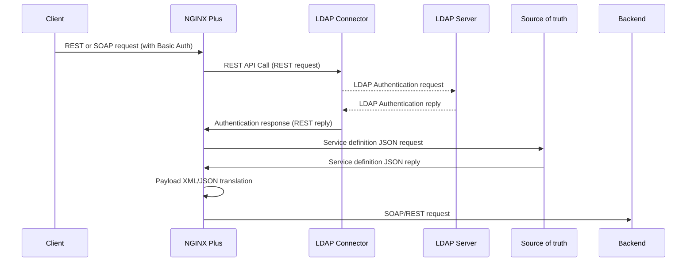
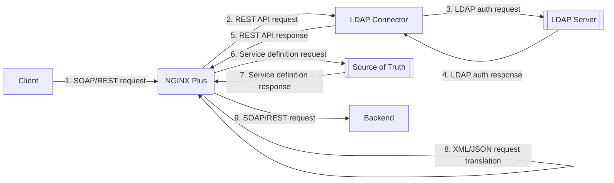

# NGINX SOAP/REST gateway

## Description

This is a sample NGINX Plus SOAP/REST gateway configuration to translate between SOAP webservices and REST APIs.

NGINX Plus manages client requests based on service definitions provided by an external REST-enabled backend, and translates between XML and JSON based on custom templates.

## Prerequisites

This repo has been tested with:

- Linux VM
- Docker compose v2.20.2+
- NGINX Plus R33+ license (`nginx-repo.crt`, `nginx-repo.key` and `license.jwt`)

## Current status / work in progress

XML/JSON and JSON/XML translation are performed based on templates or in automatic mode

| JSON to XML | XML to JSON  | Request | Response | Template-based | Automatic |
|-------------|--------------|---------|----------|----------------|-----------|
|      X      |              |    X    |          |       X        |           |
|      X      |              |    X    |    X     |                |     X     |

## High level architecture

Sequence diagram



Flowchart



## How to deploy

A docker-compose YAML file is provided to spin up all components. `nginx/Dockerfile` has been created starting from https://docs.nginx.com/nginx/admin-guide/installing-nginx/installing-nginx-docker/

To start the environment:

1. Run the startup script: during its first run it will build all Docker images

```
$ ./nginx-soap-rest.sh -o start -C /etc/ssl/nginx/nginx-repo.crt -K /etc/ssl/nginx/nginx-repo.key -j ./license.jwt
[+] Running 6/6
[...]
 ✔ Network nginx-soap-rest_lab-network  Created
 ✔ Container nginx                      Started
 ✔ Container ldap-connector             Started
 ✔ Container source-of-truth            Started
 ✔ Container echo-server                Started
 ✔ Container openldap                   Started
```

2. Check running containers:

```
$ docker ps
CONTAINER ID   IMAGE                   COMMAND                  CREATED         STATUS                   PORTS                                        NAMES
738fbd26a28e   osixia/openldap:1.5.0   "/container/tool/run"    8 minutes ago   Up 6 minutes (healthy)   0.0.0.0:389->389/tcp, 0.0.0.0:636->636/tcp   openldap
9052b76a4c34   source-of-truth         "/bin/sh -c /deploym…"   8 minutes ago   Up 6 minutes             0.0.0.0:10080->10080/tcp                     source-of-truth
bb8ce93e9b26   echo-server             "/bin/sh -c /deploym…"   8 minutes ago   Up 6 minutes             0.0.0.0:8000->8000/tcp                       echo-server
50be30c44fb9   ldap-connector          "/bin/sh -c '/deploy…"   8 minutes ago   Up 6 minutes             0.0.0.0:5389->5389/tcp                       ldap-connector
b659e2dde454   nginx-soap-rest         "nginx -g 'daemon of…"   8 minutes ago   Up 6 minutes             0.0.0.0:80->80/tcp                           nginx
```

3. Test LDAP authentication through the LDAP connector. The LDAP connector provides NGINX with a REST API and acts as an LDAP client

```
$ curl -iX POST 127.0.0.1:5389/ldap/auth -u "alice:testpassword" -w '\n'
HTTP/1.1 200 OK
date: Wed, 09 Aug 2023 13:36:39 GMT
server: uvicorn
content-length: 38
content-type: application/json

{"detail":"Authentication successful"}
```

4. Test the source of truth:

```
$ curl -s 127.0.0.1:10080/fetchallkeys
{"rules":[{"enabled":"true","request_translation":{"to_xml":"<soapenv:Envelope xmlns:soapenv=\"http://schemas.xmlsoap.org/soap/envelope/\" xmlns:msg=\"http://test/sampleXMLRequest\"><soapenv:Header/><soapenv:Body><msg:wsServiceRequest><msg:username>$JSON.username$</msg:username><msg:email>$JSON.email$</msg:email><msg:userdata><msg:id>$JSON.userid$</msg:id><msg:phone>$JSON.phone$</msg:phone></msg:userdata></msg:wsServiceRequest></soapenv:Body></soapenv:Envelope>"},"ruleid":1,"upstream":"10.5.0.13:8000","upstream_content":"xml","uri":"test.xml"},{"enabled":"true","ruleid":2,"upstream":"10.5.0.13:8000","upstream_content":"xml","uri":"auto.xml"},{"enabled":"true","ruleid":3,"upstream":"10.5.0.13:8000","upstream_content":"json","uri":"auto.json"}]}
```

5. Test the echo server:

```
$ curl -X POST http://127.0.0.1:8000 -d '{"parm":123}' -w '\n' -i
HTTP/1.0 200 OK
Server: BaseHTTP/0.6 Python/3.10.12
Date: Thu, 10 Aug 2023 14:53:28 GMT
Content-type: text/plain

{"parm":123}
```

6. Test NGINX:

```
$ curl -i 127.0.0.1
HTTP/1.1 401 Unauthorized
Server: nginx/1.23.4
Date: Thu, 10 Aug 2023 11:06:15 GMT
Content-Type: text/html
Content-Length: 179
Connection: keep-alive
www-authenticate: Basic
X-Custom-Header: testing123

<html>
<head><title>401 Authorization Required</title></head>
<body>
<center><h1>401 Authorization Required</h1></center>
<hr><center>nginx/1.23.4</center>
</body>
</html>
```

## Test: JSON to XML translation (template-based)

The client POSTs a JSON payload and the backend service `echo-server` expects an XML payload.

The source of truth holds service definition JSON files. Variables `$JSON.<fieldname>$` are rendered with values taken from input JSON fields.

Example template:

```
<soapenv:Envelope
	xmlns:soapenv="http://schemas.xmlsoap.org/soap/envelope/"
	xmlns:msg="http://test/sampleXMLRequest">
	<soapenv:Header/>
	<soapenv:Body>
		<msg:wsServiceRequest>
			<msg:username>$JSON.username$</msg:username>
			<msg:email>$JSON.email$</msg:email>
			<msg:userdata>
				<msg:id>$JSON.userid$</msg:id>
				<msg:phone>$JSON.phone$</msg:phone>
			</msg:userdata>
		</msg:wsServiceRequest>
	</soapenv:Body>
</soapenv:Envelope>
```

Service definition entries in the source of truth are looked up based on the `uri` requested by the client.
- `upstream` defines the backend service NGINX will `proxy_pass` the client request to
- `upstream_content` defines the backend service expected payload format `xml` or `json`
- `request_translation` defines translation templates `to_xml` or `to_json`

```
    {
      "ruleid": 1,
      "enabled": "true",
      "uri": "test.xml",
      "upstream": "10.5.0.13:8000",
      "upstream_content": "xml",
      "request_translation": {
        "to_xml": "<soapenv:Envelope xmlns:soapenv=\"http://schemas.xmlsoap.org/soap/envelope/\" xmlns:msg=\"http://test/sampleXMLRequest\"><soapenv:Header/><soapenv:Body><msg:wsServiceRequest><msg:username>$JSON.username$</msg:username><msg:email>$JSON.email$</msg:email><msg:userdata><msg:id>$JSON.userid</msg:id><msg:phone>$JSON.phone</msg:phone></msg:userdata></msg:wsServiceRequest></soapenv:Body></soapenv:Envelope>"
      }
    }
```

Test client request: 

```
curl -isH "X-Wanted-Content: xml" -X POST http://127.0.0.1/test.xml -u "alice:testpassword" -d '
{
   "username":"John Doe",
   "email":"john@doe.org",
   "userid":"U-12345",
   "phone":"(012) 345-6789"
}'
```

Response is:

```
HTTP/1.1 200 OK
Server: nginx/1.23.4
Date: Thu, 10 Aug 2023 16:05:52 GMT
Content-Type: text/xml
Transfer-Encoding: chunked
Connection: keep-alive
X-Custom-Header: testing123

<soapenv:Envelope
	xmlns:soapenv="http://schemas.xmlsoap.org/soap/envelope/"
	xmlns:msg="http://test/sampleXMLRequest">
	<soapenv:Header/>
	<soapenv:Body>
		<msg:wsServiceRequest>
			<msg:username>John Doe</msg:username>
			<msg:email>john@doe.org</msg:email>
			<msg:userdata>
				<msg:id>U-12345</msg:id>
				<msg:phone>(012) 345-6789</msg:phone>
			</msg:userdata>
		</msg:wsServiceRequest>
	</soapenv:Body>
</soapenv:Envelope>
```

NGINX logs report:

```
$ docker logs nginx -f
2023/08/10 16:05:53 [warn] 8#8: *5 js: Request: Client[10.5.0.1] Scheme[http] Method[POST] Host[127.0.0.1] URI [/test.xml] Body[
{
   "username":"John Doe",
   "email":"john@doe.org",
   "userid":"U-12345",
   "phone":"(012) 345-6789"
}]
2023/08/10 16:05:53 [warn] 8#8: *5 js: Subrequest [/sourceOfTruth/fetchkey/test.xml]
2023/08/10 16:05:53 [warn] 8#8: *5 js: subReqCallback got 200
2023/08/10 16:05:53 [warn] 8#8: *5 js: Rewrite rule [127.0.0.1/test.xml] -> upstream content [xml]
2023/08/10 16:05:53 [warn] 8#8: *5 js: Upstream wants XML payload
2023/08/10 16:05:53 [warn] 8#8: *5 js: Payload translation JSON -> XML
2023/08/10 16:05:53 [warn] 8#8: *5 js: ===> Template-based JSON to XML translation
2023/08/10 16:05:53 [warn] 8#8: *5 js: Request body: [[object Object]]
2023/08/10 16:05:53 [warn] 8#8: *5 js: Template    : [<soapenv:Envelope xmlns:soapenv="http://schemas.xmlsoap.org/soap/envelope/" xmlns:msg="http://test/sampleXMLRequest"><soapenv:Header/><soapenv:Body><msg:wsServiceRequest><msg:username>$JSON.username$</msg:username><msg:email>$JSON.email$</msg:email><msg:userdata><msg:id>$JSON.userid$</msg:id><msg:phone>$JSON.phone$</msg:phone></msg:userdata></msg:wsServiceRequest></soapenv:Body></soapenv:Envelope>]
2023/08/10 16:05:53 [warn] 8#8: *5 js: => JSON -> XML Translation token [JSON.username]
2023/08/10 16:05:53 [warn] 8#8: *5 js:    username found in JSON payload
2023/08/10 16:05:53 [warn] 8#8: *5 js: => JSON -> XML Translation token [JSON.email]
2023/08/10 16:05:53 [warn] 8#8: *5 js:    email found in JSON payload
2023/08/10 16:05:53 [warn] 8#8: *5 js: => JSON -> XML Translation token [JSON.userid]
2023/08/10 16:05:53 [warn] 8#8: *5 js:    userid found in JSON payload
2023/08/10 16:05:53 [warn] 8#8: *5 js: => JSON -> XML Translation token [JSON.phone]
2023/08/10 16:05:53 [warn] 8#8: *5 js:    phone found in JSON payload
2023/08/10 16:05:53 [warn] 8#8: *5 js: Request body sent to upstream: [<soapenv:Envelope xmlns:soapenv="http://schemas.xmlsoap.org/soap/envelope/" xmlns:msg="http://test/sampleXMLRequest"><soapenv:Header/><soapenv:Body><msg:wsServiceRequest><msg:username>John Doe</msg:username><msg:email>john@doe.org</msg:email><msg:userdata><msg:id>U-12345</msg:id><msg:phone>(012) 345-6789</msg:phone></msg:userdata></msg:wsServiceRequest></soapenv:Body></soapenv:Envelope>]
2023/08/10 16:05:53 [warn] 8#8: *5 js: Proxying to [http://10.5.0.13:8000]
10.5.0.1 - alice [10/Aug/2023:16:05:53 +0000] "POST /test.xml HTTP/1.1" 200 401 "-" "curl/8.0.1" "-"
```

## Test: JSON to XML translation (automatic mode)

Client request:

```
curl -isH "X-Wanted-Content: xml" -X POST http://127.0.0.1/auto.xml -u "alice:testpassword" -d '
{
   "username":"John Doe",
   "email":"john@doe.org",
   "userid":"U-12345",
   "phone":"(012) 345-6789"
}'
```

Response:

```
HTTP/1.1 200 OK
Server: nginx/1.23.4
Date: Thu, 10 Aug 2023 16:24:44 GMT
Content-Type: text/xml
Transfer-Encoding: chunked
Connection: keep-alive
X-Custom-Header: testing123

<?xml version="1.0"?>
<soapenv:Envelope
	xmlns:soapenv="http://schemas.xmlsoap.org/soap/envelope/">
	<soapenv:Header></soapenv:Header>
	<soapenv:Body>
		<username>John Doe</username>
		<email>john@doe.org</email>
		<userid>U-12345</userid>
		<phone>(012) 345-6789</phone>
	</soapenv:Body>
	<soapenv:Fault></soapenv:Fault>
</soapenv:Envelope>
```

## How to undeploy

The environment can be stopped using:

```
$ ./nginx-soap-rest.sh -o stop
[+] Running 6/6
 ✔ Container echo-server                Removed
 ✔ Container ldap-connector             Removed
 ✔ Container openldap                   Removed
 ✔ Container source-of-truth            Removed
 ✔ Container nginx                      Removed
 ✔ Network nginx-soap-rest_lab-network  Removed
```
